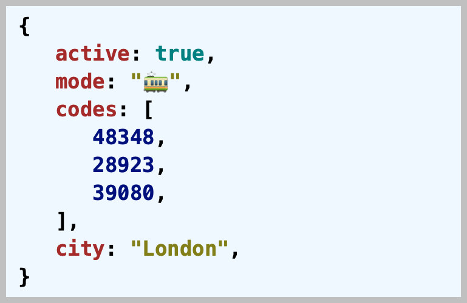
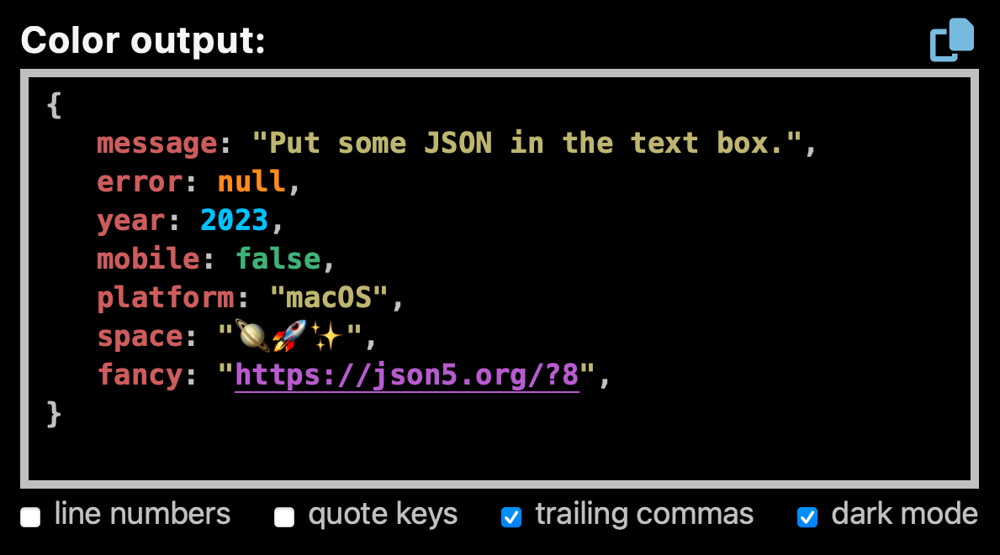

# pretty-print-json


_Pretty-print JSON data into HTML to indent and colorize_

[](https://github.com/center-key/pretty-print-json/blob/main/LICENSE.txt)
[](https://www.npmjs.com/package/pretty-print-json)
[](https://www.jsdelivr.com/package/npm/pretty-print-json)
[](https://github.com/center-key/pretty-print-json/actions/workflows/run-spec-on-push.yaml)

Source is written in functional TypeScript, and **pretty-print-json.min.js** (minified) is 2.1 KB.



## A) Try It Out
Interactive online tool to format JSON:<br>
https://pretty-print-json.js.org

## B) Setup
### 1. Web browser
Load from the [jsdelivr.com CDN](https://www.jsdelivr.com/package/npm/pretty-print-json):
```html
<link rel=stylesheet href=https://cdn.jsdelivr.net/npm/pretty-print-json@3.0/dist/css/pretty-print-json.css>
...
<script src=https://cdn.jsdelivr.net/npm/pretty-print-json@3.0/dist/pretty-print-json.min.js></script>
```
The minified JS file is 2 KB.

For **dark mode**, replace `pretty-print-json.css` with `pretty-print-json.dark-mode.css` in
the `<link>` tag.

Or to automatically sense **dark mode** based on the `prefers-color-scheme` CSS media feature, use `pretty-print-json.prefers.css` instead.
### 2. Node.js server
Install package for node:
```shell
$ npm install pretty-print-json
```
Import into your application:
```javascript
import { prettyPrintJson } from 'pretty-print-json';
```

## C) Usage
### 1. API
```javascript
const html = prettyPrintJson.toHtml(data, options?);
```
### 2. Example
##### HTML:
```html
<pre id=account class=json-container></pre>
```
##### JavaScript:
Pass data into `prettyPrintJson.toHtml(data, options)` and display the results.
```javascript
const data = {
   active: true,
   mode:   '🚃',
   codes:  [48348, 28923, 39080],
   city:   'London',
   };
const elem = document.getElementById('account');
elem.innerHTML = prettyPrintJson.toHtml(data);
```
### 3. Options
| Name (key)       | Type        | Default | Description                                                 |
| :--------------- | :---------- | :-----: | :---------------------------------------------------------- |
| `indent`         | **integer** | `3`     | Number of spaces for indentation.                           |
| `lineNumbers`    | **boolean** | `false` | Wrap HTML in an `<ol>` tag to support line numbers.<b>*</b> |
| `linkUrls`       | **boolean** | `true`  | Create anchor tags for URLs.                                |
| `linksNewTab`    | **boolean** | `true`  | Add a `target=_blank` attribute setting to anchor tags.     |
| `quoteKeys`      | **boolean** | `false` | Always double quote key names.                              |
| `trailingCommas` | **boolean** | `true`  | Append a comma after the last item in arrays and objects.   |

<b>*</b>When setting `lineNumbers` to `true`, do not use the `<pre>` tag as the `white-space: pre;`
styling is applied to each line (`<li>`).



## D) TypeScript Declarations
See the TypeScript declarations at the top of the
[pretty-print-json.ts](dist/pretty-print-json.ts) file.

Customize the output of the function `prettyPrintJson.toHtml(data: unknown, options?: FormatOptions)`
using the `options` parameter.

The `options` parameter is a `FormatOptions` object:
```typescript
type FormatOptions = {
   indent?:         number,   //number of spaces for indentation
   lineNumbers?:    boolean,  //wrap HTML in an <ol> tag to support line numbers
   linkUrls?:       boolean,  //create anchor tags for URLs
   linksNewTab?:    boolean,  //add a target=_blank attribute setting to anchor tags
   quoteKeys?:      boolean,  //always double quote key names
   trailingCommas?: boolean,  //append a comma after the last item in arrays and objects
   };
```

Example TypeScript usage with explicit types:
```typescript
import { prettyPrintJson, FormatOptions } from 'pretty-print-json';

const data = {
   active: true,
   mode:   '🚃',
   codes:  [48348, 28923, 39080],
   city:   'London',
   };
const options: FormatOptions = { linkUrls: true };
const html: string = prettyPrintJson.toHtml(data, options);
```

## E) Build Environment
Check out the `runScriptsConfig` section in [package.json](package.json) for an
interesting approach to organizing build tasks.

**CLI Build Tools for package.json**
   - 🎋 [add-dist-header](https://github.com/center-key/add-dist-header):&nbsp; _Prepend a one-line banner comment (with license notice) to distribution files_
   - 📄 [copy-file-util](https://github.com/center-key/copy-file-util):&nbsp; _Copy or rename a file with optional package version number_
   - 📂 [copy-folder-util](https://github.com/center-key/copy-folder-util):&nbsp; _Recursively copy files from one folder to another folder_
   - 🪺 [recursive-exec](https://github.com/center-key/recursive-exec):&nbsp; _Run a command on each file in a folder and its subfolders_
   - 🔍 [replacer-util](https://github.com/center-key/replacer-util):&nbsp; _Find and replace strings or template outputs in text files_
   - 🔢 [rev-web-assets](https://github.com/center-key/rev-web-assets):&nbsp; _Revision web asset filenames with cache busting content hash fingerprints_
   - 🚆 [run-scripts-util](https://github.com/center-key/run-scripts-util):&nbsp; _Organize npm package.json scripts into groups of easy to manage commands_
   - 🚦 [w3c-html-validator](https://github.com/center-key/w3c-html-validator):&nbsp; _Check the markup validity of HTML files using the W3C validator_

<br>

---
To see some example HTML results, run `npm install`, `npm test`, and then `node spec/examples.js`.

Feel free to submit questions at:<br>
[github.com/center-key/pretty-print-json/issues](https://github.com/center-key/pretty-print-json/issues)

[MIT License](LICENSE.txt) |
[Blog post](https://blog.centerkey.com/2013/05/javascript-colorized-pretty-print-json.html)
