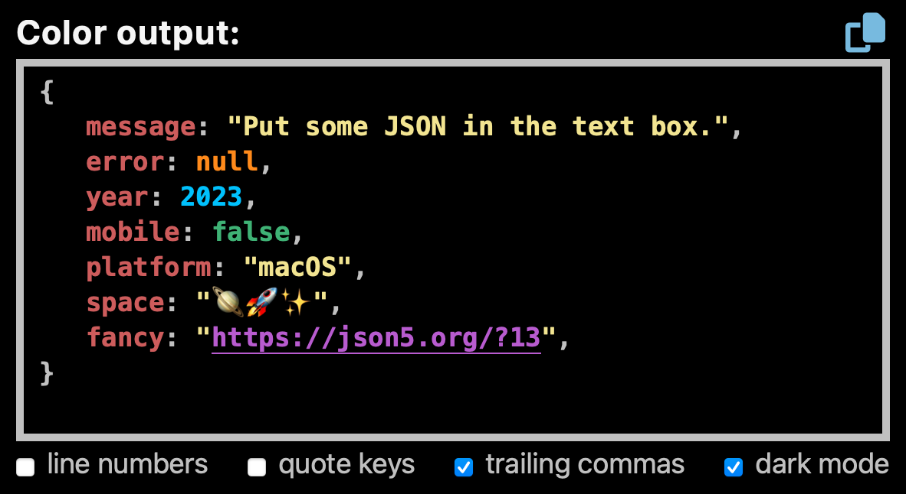

# pretty-print-json


_Pretty-print JSON data into HTML to indent and colorize (written in functional TypeScript)_

[](https://github.com/center-key/pretty-print-json/blob/main/LICENSE.txt)
[](https://www.npmjs.com/package/pretty-print-json)
[](https://bundlephobia.com/package/pretty-print-json)
[](https://snyk.io/test/github/center-key/pretty-print-json)
[](https://www.jsdelivr.com/package/npm/pretty-print-json)
[](https://github.com/center-key/pretty-print-json/actions/workflows/run-spec-on-push.yaml)


## A) Try It Out
Interactive online tool to format JSON:<br>
https://pretty-print-json.js.org

## B) Setup
### 1. Web browser
Load from the [jsdelivr.com CDN](https://www.jsdelivr.com/package/npm/pretty-print-json):
```html
<link rel=stylesheet href=https://cdn.jsdelivr.net/npm/pretty-print-json@1.4/dist/css/pretty-print-json.css>
...
<script src=https://cdn.jsdelivr.net/npm/pretty-print-json@1.4/dist/pretty-print-json.min.js></script>
```
For **dark mode**, replace `pretty-print-json.css` with `pretty-print-json.dark-mode.css` in
the `<link>` tag.

Or to automatically sense **dark mode** based on the `prefers-color-scheme` CSS media feature, use `pretty-print-json.prefers.css` instead.
### 2. Node.js server
Install package for node:
```shell
$ npm install pretty-print-json
```
Import into your application:
```javascript
import { prettyPrintJson } from 'pretty-print-json';
```
Or for older CommonJS/UMD environments:
```javascript
const { prettyPrintJson } = require('pretty-print-json');  //deprecated -- use ES modules instead
```

## C) Usage
### 1. API
```javascript
const html = prettyPrintJson.toHtml(data, options?);
```
### 2. Example
##### HTML:
```html
<pre id=account class=json-container></pre>
```
##### JavaScript:
Pass data into `prettyPrintJson.toHtml(data, options)` and display the results.
```javascript
const data = { active: true, mode: '🚃', codes: [48348, 28923, 39080], city: 'London' };
const elem = document.getElementById('account');
elem.innerHTML = prettyPrintJson.toHtml(data);
```
### 3. Options
| Name (key)      | Type        | Default | Description                                                     |
| :-------------- | :---------- | :------ | :-------------------------------------------------------------- |
| `indent`        | **integer** | `3`     | Number of spaces for indentation.                               |
| `lineNumbers`   | **boolean** | `false` | Wrap HTML in an `<ol>` tag to support line numbers.<b>*</b>     |
| `linkUrls`      | **boolean** | `true`  | Create anchor tags for URLs.                                    |
| `linksNewTab`   | **boolean** | `true`  | Create `target=_blank` attribute on anchor tags.                |
| `quoteKeys`     | **boolean** | `false` | Always double quote key names.                                  |
| `trailingComma` | **boolean** | `false` | Add a comma after the last item in arrays and objects.<b>**</b> |

<b>*</b>When setting `lineNumbers` to `true`, do not use the `<pre>` tag as the `white-space: pre;`
styling is applied to each line (`<li>`).

<b>**</b>HEADS UP: In a future release, the default for `trailingComma` will be switched to `true`.



## D) TypeScript Declarations
See the TypeScript declarations at the top of the
[pretty-print-json.ts](dist/pretty-print-json.ts) file.

The output of the `prettyPrintJson.toHtml(thing: unknown, options?: FormatOptions)` function is
configured with a `FormatOptions` object:
```typescript
type FormatOptions = {
   indent?:        number,   //number of spaces for indentation
   lineNumbers?:   boolean,  //add line numbers
   linkUrls?:      boolean,  //create anchor tags for URLs
   linksNewTab?:   boolean,  //create target=_blank attribute on anchor tags
   quoteKeys?:     boolean,  //always double quote key names
   trailingComma?: boolean,  //add a comma after the last item in arrays and objects
   };
```

Example TypeScript usage with explicit types:
```typescript
import { prettyPrintJson, FormatOptions } from 'pretty-print-json';

const data = { active: true, mode: '🚃', codes: [48348, 28923, 39080], city: 'London' };
const options: FormatOptions = { linkUrls: true };
const html: string = prettyPrintJson.toHtml(data, options);
```
<br>

---
To see some example HTML results, run `npm install`, `npm test`, and then `node spec/examples.js`.

Feel free to submit questions at:<br>
[github.com/center-key/pretty-print-json/issues](https://github.com/center-key/pretty-print-json/issues)

[MIT License](LICENSE.txt) |
[Blog post](https://blog.centerkey.com/2013/05/javascript-colorized-pretty-print-json.html)
